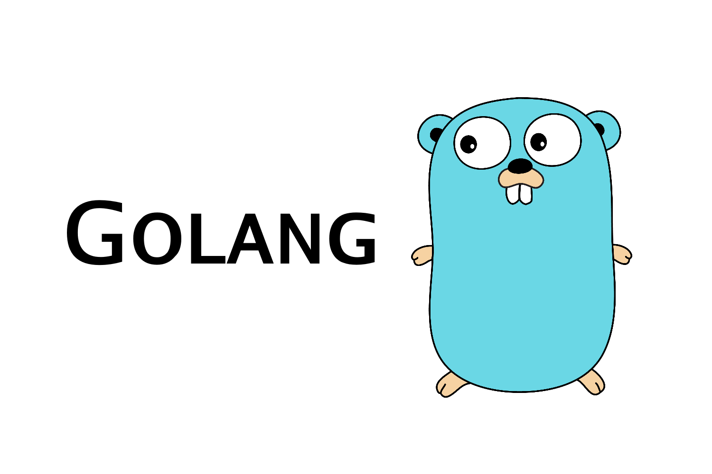

---
title:
- Go
author:
- Dario Necco
theme:
- Nalug
date:
- May 08, 2021
---

---#


---#
# Introduction

* Open-source
* Compiled
* Binaries can be created for all platforms
* Strongly Typed language
* Fast : [https://benchmarksgame-team.pages.debian.net/benchmarksgame/fastest/go-python3.html](https://benchmarksgame-team.pages.debian.net/benchmarksgame/fastest/go-python3.html)
* Readability and minimalism
    provides methods for automatic formatting of your code.

---##
##  Concurrent programming
The Go language is built with concurrent programming. It means that goroutines, select statements and channels of Golang are primitives and are specifically build for concurrency. So, this means you can run the language on multiple processes at the same time and on the same core.
One particular disadvantage with Go's concurrency is that it may lead to race conditions. However, Go provides race condition detection but it works only after race condition actually happened.

---## 
## Garbage collection
Go is a garbage-collected programming language, so it will automatically free up the program memory that you no longer require. So one can say that, Go garbage collectors will act as the knob that will let you adjust CPU memory as per your need. It will also enable you to protect your projects against memory leakages.

---##
## Cross-platform
Go is a cross-platform language, which means you can compile it on your machine and run it anywhere, including Windows, Linux, Mac, etc. So, with Golang, you can generate tons of cross-platform binaries. This feature makes the language truly adaptable and portable.

---##
## Fun fact
The language is just called **Go**, but the term "Golang" became popular with their website golang.org which is taken as "go.org" was unavailable!


---#
# Who uses it

* **Google** - Being the father of Go, the company itself utilizes the language for its cloud services and infrastructure.

* **Uber** - for scaling up its geofence microservices to enhance map processing speed.

* **Netflix** - for handling big data processing, for the recommendation of TV series and movies, in particular.

* **Salesforce** - also migrated to Go for Einstein Analytics to resolve its readability issue.

* **Novartis** - this Pharma giant uses Go to develop web apps and execute PL/SQL scripts.

* **YouTube** - for handling the ever-increasing load on their website.

---#
# Bibliography

* [The Go Programming Language - Alan A. A. Donovan, Brian W. Kernighan](https://www.google.it/books/edition/The_Go_Programming_Language/SJHvCgAAQBAJ?hl=it&gbpv=1&printsec=frontcover) 
* [Go Bootcamp - Matt Aimonetti](http://www.golangbootcamp.com/book) (free)
* [An introduction to programming in Go - Caleb Doxsey](http://www.golang-book.com/books/intro) (free)
* [The Little Go Book - Karl Seguin](https://www.openmymind.net/The-Little-Go-Book/)
* [Go 101 - Tapir Liu](https://go101.org/article/101.html)  ([free](https://github.com/go101/go101/releases))
* [Let's Go - Alex Edwards](https://lets-go.alexedwards.net/)
* [The way to Go - Ivo Balbaert](https://www.google.it/books/edition/The_Way_to_Go/oowq_6bAgloC?hl=it&gbpv=1&printsec=frontcover)

---#
# Installation

```bash
{data-line-numbers}
export version=1.16.4
 
# Download package
wget https://golang.org/dl/go${version}.linux-amd64.tar.gz

# extract the package in /usr/local
sudo rm -rf /usr/local/go && sudo tar -C /usr/local -xzf go${version}.linux-amd64.tar.gz

# 
export PATH=$PATH:/usr/local/go/bin

# print version
go version
```

---#
# IDE

---##

## VSCode
The VS Code plugin is developed and maintened by Google developers: [Go](https://marketplace.visualstudio.com/items?itemName=golang.go)

```bash
# download the vscode package
wget -O vscode.deb https://az764295.vo.msecnd.net/stable/3c4e3df9e89829dce27b7b5c24508306b151f30d/code_1.55.2-1618307277_amd64.deb

# install the package 
sudo dpkg -i vscode.deb
```

1. Install the [Go](https://marketplace.visualstudio.com/items?itemName=golang.go) extension
1. `View -> Command Palette...`
1. Type **goinstall** `-> Go Install/Update Tools`
1. Select All `->` wait for installation

---##

## LiteIDE

```bash
wget -O liteide.tar.gz https://github.com/visualfc/liteide/releases/download/x37.4/liteidex37.4.linux64-qt5.5.1.tar.gz

tar -zxvf liteide.tar.gz

```

---##

## Goland

* [Goland by Jetbrains](https://www.jetbrains.com/go/download/download-thanks.html?platform=linux)

* Proprietary software
* On-fly static analysis out of box

---#
# Structure

* `src`: contains Go source files.
The `src` directory typically contains many version control repositories containing one or more Go packages. Every Go source file belongs to a package. You generally create a new subdirectory inside your repository for every separate Go package.

* `bin`: contains the binary executables.
The Go tool builds and installs binary executables to this directory. All Go programs that are meant to be executables must contain a source file with a special package called main and define the entry point of the program in a special function called main().

* `pkg`: contains Go package archives (.a).
All the non-executable packages (shared libraries) are stored in this directory. You cannot run these packages directly as they are not binary files. They are typically imported and used inside other executable packages.


---#
# Environment variables

---##
## GOPATH
lists places to look for Go code. On Unix, the value is a colon-separated string. On Windows, the value is a semicolon-separated string. On Plan 9, the value is a list.GOPATH must be set to get, build and install packages outside the standard Go tree.

---##
## GOROOT
The Go binary distributions assume they will be installed in /usr/local/go (or c:\Go under Windows), but it is possible to install the Go tools to a different location. In this case you must set the GOROOT environment variable to point to the directory in which it was installed.For example, if you installed Go to your home directory you should add the following commands to $HOME/.profile:export GOROOT=$HOME/go

---#
# Go Command line

```
Go is a tool for managing Go source code.

Usage:

        go <command> [arguments]

The commands are:

        bug         start a bug report
        build       compile packages and dependencies
        clean       remove object files and cached files
        doc         show documentation for package or symbol
        env         print Go environment information
        fix         update packages to use new APIs
        fmt         gofmt (reformat) package sources
        generate    generate Go files by processing source
        get         add dependencies to current module and install them
        install     compile and install packages and dependencies
        list        list packages or modules
        mod         module maintenance
        run         compile and run Go program
        test        test packages
        tool        run specified go tool
        version     print Go version
        vet         report likely mistakes in packages
```

---##
## go fmt

```bash
gofmt -w file.go

go fmt path/to/your/package
```

* easier to write: never worry about minor formatting concerns while hacking away.

* easier to read: when all code looks the same you need not mentally convert others' formatting style into something you can understand.

* easier to maintain: mechanical changes to the source don't cause unrelated changes to the file's formatting; diffs show only the real changes.

* uncontroversial: never have a debate about spacing or brace position ever again!


---#
# File structure

* `go.mod`: contains dependencies (which can be get with `go get` command or just writing the .go file and running `go mod tidy`)

```go
module github.com/steevehook/go-modules

go 1.14

require (
	github.com/julienschmidt/httprouter v1.3.0 // indirect
	go.uber.org/zap v1.14.1 // indirect
)
```
    
`indirect` comment means the package is downloaded but not used in the project
    
* `go.sum`: it is containing the expected cryptographic hashes of the content of specific module versions.


---#
# Getting started

```bash
mkdir hello
cd hello
go mod init example.com/hello

nano hello.go

```

```go
package main

import "fmt"

func main() {
    fmt.Println("Hello, World!")
}
```

```
go run .
```

---##
## Add package 

**`"rsc.io/quote"`**

```go
package main

import "fmt"

import "rsc.io/quote"

func main() {
    fmt.Println(quote.Go())
}
```

---#
# Conventions

---## 
## Folder package and package name should have the same name

* Good practice : Folder `app/network` -> package `network`
```
.
├─ app/
│  └─ network/
│         └─ main.go/
```

```
package network

// ...
```

* Bad practice : Folder `app/network` -> `package network`
```
.
├─ app/
│  └─ net/
│         └─ main.go/
```

```
package network

// ...
```

---##
## Directory or package name should be one word

* Good practice
```
.
├─ app/
│  └─ network/
│  	      └─ main.go/
```

* Bad practice
```
.
├─ app/
│  └─ net_err/
│  	      └─ main.go/
```

```
.
├─ app/
│  └─ netErr/
│  	      └─ main.go/
```

---##
## Directory or package name should be specific

* Bad practice 
```
.
├─ app/
│  └─ utils/
│  	      └─ main.go/
```

---##
## Avoid nested packages - keep the structure flat

* Bad practice
```
.
├─ app/
│  └─ pkg/
│  	   └─ sub_pkg/
│  	          └─ sub_pkg/        
│        	          └─ sub_pkg/                
```

---##
1. Tabs are recommended over spaces
1. Go follows a convention where source files are all lower case with underscore separating multiple words.
1. Compound file names are separated with `_`
1. File names that begin with `.` or `_` are ignored by the go tool
1. Files with the suffix `_test.go` are only compiled and run by the `go test` tool.

> `go fmt` or `gofmt -w .` take care of the formatting


---#
# Comments

* Single line comment

```go
// Single-line Comment
```

* Block comment

```go
/* 
	Block comment
*/
```

---#
# Import
Allows to include external modules in the project.
Many are built-in 
<br>
(e.g.: `fmt`)


---##
## One statement

```go
import ("fmt"; "math")

// OR

import ("fmt"
        "math")
```

---##
## Multiple statements

```go
import "fmt"
import "math"
```

---##    
## Import with alias
```go
import (
    quoteV3 "rsc.io/quote/v3"
)
```

---##
## Fail
Go doesn't allow recursive import (cross reference):
    main -> p1 -> p2 -> p1

---##
### Import structure

```go
package pkg
import "github.com/gophertuts/go-basics/net"
```

* `github.com` : Host
* `gophertuts` : User/Organization 
* `go-basics` : Project/Repo
* `net` : package

---#
# Variables

Variables are names used to hold values.

---##
## Full declaration

```go
var <variable-name/s> <type>

var x int

var x,y int

var x,y int = 2  // declaring and initializing more variable in one statement.
```

---##
## Implicit type 

* type is not specified (requires initialization)

```go
var <variable> = <value>

var x = 100
```

---##
## Short variable declaration

> allowed only inside a fuction

```go
<variable-name>:=<value>
x := 100
```

---##
## Single statement multiple declaration

```go
var (  
      name1 = initialvalue1
      name2 = initialvalue2
)
```

```go
var (
	name   = "naveen"
	age    = 29
	height int
)
```

---##
> Uninitialized variables have a zero value

```go
var x int     // x = 0
var x string  // x = ""
```

---#
# Pointers

Variables contain the **memory address** of a variable.

Usually used for modifying a value of a variable within a function.

* `*` (deference operator) before a variable name means get the value of the value of the variable (from the address, which is what the variable is storing) 
* `&` before a variable name gets the address of the item

---##
```go
package main

import (
	"fmt"
)

func main() {
    toChange := "hello"
    var pointer *string = &toChange
    fmt.Println(pointer, *pointer, &pointer)
}

/*
0xc000010240 hello 0xc00000e028
*/
```

* `pointer` :  address where the content of `toChange` (`"hello"`) is stored
* `*pointer` : access the content of the address (`"hello"`)
* `&pointer` : gets the pointer that points to `toChange` (pointer to the pointer)


---##
## Case 1

```go
{data-line-numbers="all|7-9,5-6,18"}
package main

import (
	"fmt"
)

func changeValue(str *string) {
	*str = "changed!"
}

func changeValue2(str string) {
	str = "changed!"
}

func main() {
    toChange := "hello"
    fmt.Println(toChange)  // Print before
    changeValue(toChange)
    fmt.Println(toChange)  // Print after
}
```

```
hello
changed!
```

---##
## Case 2

```go
{data-line-numbers="all|11-13,5-6,18"}
package main

import (
	"fmt"
)

func changeValue(str *string) {
	*str = "changed!"
}

func changeValue2(str string) {
	str = "changed!"
}

func main() {
    toChange := "hello"
    fmt.Println(toChange)  // Print before
    changeValue2(toChange)
    fmt.Println(toChange)  // Print after
}
```

```
hello
hello
```

The value only changed locally in the function because I didn't pass the pointer and I passed the value "hello" to the function.


---##
For struct there is no need to use `*` for pointing to the value.

```go
{data-line-numbers="10-12,15-16|11"}
package main

import "fmt"

type Point struct {
	x int32
	y int32
}

func changeX(pt *Point) {
	pt.x = 100
}

func main() {
	pt := Point{y: 3, x: 4}
	changeX(&pt)      // the x of "pt" becomes 100

	fmt.Println(pt)   // {100 3} 
}
```


```go
func main() {
    x := 7
    
    y := &x  // access the address of "x" variable
    fmt.Println(x, y)  // 7 0xc0000140b8
    
    *y = 8   // Dereference: access where it's pointing to
    fmt.Println(x, y)  // 8 0xc0000140b8
    
}
```


---#
# Types

Determines the values that the variable can have and the operations that can be performed on it.


---##
## Const

```go
const pi = 3.14
```

---##
## Integers

* `int`
* `int8` : has size 1 byte. Covers range -128 to 127;
* `int16` : has size 2 bytes : -32.768 to 32.767;
* `int32` : has size 4 bytes: -2.147.483.648 to 2.147.483.647;
* `int64` : has size 8 bytes : -9 X 10 to 9 X 1018.
* `uint8` : unsigned integer of 1 byte : 0 to 255;
* `uint16` : unsigned integer of 2 bytes : 0 to 65.535;
* `uint32` : unsigned integer of 4 bytes :  4.294.967.295;
* `uint64` : unsigned integer of 8 bytes : 18 X 1018;

---##
## Floats
- `float32` ~ 6 digits precision

```go
var d float32 = 1.222
```

- `float64` ~ 15 digits precision

```go
123.45
1.2345e2
```

---##
## Complex

- `complex64`
- `complex128`

```go
var z complex128 = complex(2,3)  // real and imaginary

var x complex128 = cmplx.Sqrt(-5 + 12i)
```

---##
## Bytes and rune
In Go, the byte (uint8) and rune (int32) data types are used to distinguish characters from integer values.

Golang doesn’t have a char data type. It uses byte and rune to represent character values. The byte data type represents ASCII characters and the rune data type represents a more broader set of Unicode characters that are encoded in UTF-8 format.

```go
var firstLetter = 'A' // Type inferred as `rune` (Default type for character values)
```

You can create a byte variable by explicitly specifying the type -

```go
var lastLetter byte = 'Z'
```


---##
Both byte and rune data types are essentially integers. For example, a byte variable with value 'a' is converted to the integer 97.

Similarly, a rune variable with a unicode value '♥' is converted to the corresponding unicode codepoint U+2665, where U+ means unicode and the numbers are hexadecimal, which is essentially an integer.

```go
package main
import "fmt"

func main() {
	var myByte byte = 'a'
	var myRune rune = '♥'

	fmt.Printf("%c = %d and %c = %U\n", myByte, myByte, myRune, myRune)
}
```

```go
a = 97 and ♥ = U+2665
```
(myByte `->` character, decimal; myRune `->` character, unicode)


---##
## String

A "string" is a sequence of bytes (not of a rune). 

* Double quotes
* Backtick

```go
var d string = "hello world"

var e string = `This is a 
Multiline
string
`
```

---##
## Array

Elements of the same type with a fixed length definined at the declaration stage. It cannot be expanded.

```go
var a [5]int                 // fixed 
var multiD [2][3]int         // multidimensional array       
```


---##
## Slice

As arrays, but the length can be expanded.

```go
var b []int

numbers := make([]int,5,10)  // initial length of 5 and capacity of 10
```

Sub-slice can be created starting from another slice.

```go
// initialize a slice with 4 len and values
number2 = []int{1,2,3,4}
fmt.Println(numbers)     // -> [1 2 3 4]

// create sub slices
slice1 := number2[2:]
fmt.Println(slice1)      // -> [3 4]

slice2 := number2[:3]
fmt.Println(slice2)      // -> [1 2 3]

slice3 := number2[1:4]
fmt.Println(slice3)      // -> [2 3 4]
```

---##
## Map 
Structure key-value

```go
var m map[string]int      // key is string - value is integer
```

```go
// adding key/value
m['clearity'] = 2
m['simplicity'] = 3

// printing the values
fmt.Println(m['clearity'])   // -> 2
fmt.Println(m['simplicity']) // -> 3
```

```go
countryCapitalMap := map[string]string{
    "France": "Paris",
    "Italy":  "Rome",
    "Japan":  "Tokyo",
}
```

> Last element needs to have the comma `,`


---##
## Struct


```go
package main

type Point struct {
    x int32
    y int32
}

func main() {
    var p1 Point = Point{1,2}
    var p2 Point = Point{-5,7}
}
```

---##
##  Struct methods
If used for modifying a struct value, the Struct argument needs to be passed as pointer.

```go
{data-line-numbers="all|11-13,23-24|15-17,26-27"}
package main

import "fmt"

type Student struct {
    name   string
    grades []int
    age    int
}

func (s Student) getAge() int {
    return s.age
}

func (s *Student) setAge(age int) {
    s.age = age
}

func main() {
    // create student
    s1 := Student{"Tim", []int{70, 90, 80, 85}, 19}

    // use method ".getAge()"
    fmt.Println(s1.getAge()) // 19

    // use method ".setAge()"
    s1.setAge(7)
    fmt.Println(s1) // {Tim [70 90 80 85] 7}

}
```

---##

## Embedded Struct

* Struct inside another struct

```go
{data-line-numbers="all|5-13,16|12"}
package main

import "fmt"

type Point struct {
    x int32
    y int32
}

type Circle struct {
    radius float64
    center *Point           // Struct inside another struct
}

func main() {
    c1 := Circle{4.56, &Point{4,5}}
    
    fmt.Println(c1.center)  // &{4,5}
}
```


---##
```go
{data-line-numbers="all|5-13,16|12"}
package main

import "fmt"

type Point struct {
    x int32
    y int32
}

type Circle struct {
    radius float64
    *Point              // Struct inside another struct
}

func main() {
    c1 := Circle{4.56, &Point{4,5}}
    
    fmt.Println(c1.x)  // 4
}
```

---##
## Tags

A tag for a field allows you to attach meta-information to the field which can be acquired using reflection.

Usually it is used to provide transformation info on how a struct field is encoded to or decoded from another format (or stored/retrieved from a database), but you can use it to store whatever meta-info you want to, either intended for another package or for your own use.

```go
type User struct {
    Name string `json:"name" xml:"name"`
}
```

---##
#### Interface

Allows to implement a slice containing values of different types (as lists in python)

```go
{data-line-numbers="all|2"}
func main() {
	arr := []interface{}{1, 2, "apple", true}
	fmt.Println(arr)

	i := arr[0].(int)
	fmt.Printf("i: %d, i type: %T\n", i, i)

	s := arr[2].(string)
	fmt.Printf("b: %s, i type: %T\n", s, s)

	fmt.Printf("b: %s, i type: %T\n", arr[2], arr[2])
}
```

```
[1 2 apple true]
i: 1, i type: int
b: apple, i type: string
b: apple, i type: string
```

---##
### Empty Interface

The interface type that specifies zero methods is known as the *empty interface*:

```go
interface{}
```

An empty interface may hold values of any type. (Every type implements at least zero methods).

They are used by code that handles values of unknown type. 

---##
```go
{data-line-numbers="all|6,9,12"}
package main

import "fmt"

func main() {
	var i interface{}
	describe(i)

	i = 42
	describe(i)

	i = "hello"
	describe(i)
}

func describe(i interface{}) {
	fmt.Printf("(%v, %T)\n", i, i)
}
```

```
(<nil>, <nil>)
(42, int)
(hello, string)
```

---##
## Type Declaration

Craetes a type alias which can make more sense in the application

```go
// Create types
type Celsius float64
type IDnum int

// Use new types
var temp Celsius
var pid IDnum
```

---##
## Type Conversions

```go
T()  // where T is the final type 
```

```go
var x int32 = 1
var y int16 = 2
x = y // not possible as the types are different: cannot use y (type int16) as type int32 in assignment

x = int32(y)
```

---#
# Printing / String formatting

* `Print` : formats using the default formats for its operands and writes to standard output. Spaces are added between operands when neither is a string. It returns the number of bytes written and any write error encountered.

```go
package main

import "fmt"

func main() {
	const name, age = "Kim", 22

    /* Print */
    fmt.Print(name, " is ", age, " years old.\n")
}
```

```
Kim is 22 years old

```

> Note carriage return at end

---##
* `Printf` : formats according to a format specifier and writes to standard output. It returns the number of bytes written and any write error encountered.

```go
package main

import "fmt"

func main() {
	const name, age = "Kim", 22

    /* Printf */
    fmt.Printf("%s is %d years old.\n", name, age)

}
```

```
Kim is 22 years old

```

> Note carriage return at end

---##
* `Println` : formats using the default formats for its operands and writes to standard output. Spaces are always added between operands and a newline is appended. It returns the number of bytes written and any write error encountered.

```go
package main

import "fmt"

func main() {
	const name, age = "Kim", 22
   
    /* Println */
    fmt.Println(name, "is", age, "years old.")

}
```

```
Kim is 22 years old

```

> Note carriage return at end added by the function.

---##
* `Sprint` : formats using the default formats for its operands and returns the resulting string. Spaces are added between operands when neither is a string.

```go
package main

import "fmt"

func main() {
	const name, age = "Kim", 22
   
    /* Sprint */
	s := fmt.Sprint(name, " is ", age, " years old.\n")
	io.WriteString(os.Stdout, s) // Ignoring error for simplicity.

}
```

```
Kim is 22 years old

```

> Note carriage return at end.

---##
* `Sprintf` : formats according to a format specifier and returns the resulting string.


```go
package main

import "fmt"

func main() {
	const name, age = "Kim", 22
   
    /* Sprintf */
	s := fmt.Sprintf("%s is %d years old.\n", name, age)
	io.WriteString(os.Stdout, s) // Ignoring error for simplicity.
}
```

```
Kim is 22 years old

```

> Note carriage return at end added by the function.

---##
* `Sprintln` : formats using the default formats for its operands and returns the resulting string. Spaces are always added between operands and a newline is appended.


```go
package main

import "fmt"

func main() {
	const name, age = "Kim", 22
   
    /* Sprintln */
    s := fmt.Sprintln(name, "is", age, "years old.")
	io.WriteString(os.Stdout, s) // Ignoring error for simplicity.
}
```

```
Kim is 22 years old

```

> Note carriage return at end added by the function.


---##
# `io.WriteString(w, s)`

* Write the contents of the stated string “s” to the writer “w”, which takes a slice of bytes.

* Returns the total number of bytes of the content of type int and also returns an error if any.

* Comment `// Ignoring error for simplicity.` in the previous slides is related to the return values which have been ignored.

```go
/* Sprint */
s := fmt.Sprint(name, " is ", age, " years old.\n")
l, err := io.WriteString(os.Stdout, s)

if err != nil {
    panic(err)
}
```

---##
# Format variables

* [https://golang.org/pkg/fmt/](https://golang.org/pkg/fmt/)

```go
var(
	a = 654
	b = false
	c = 2.651
	d = 4 + 1i
	e = "Australia"
	f = 15.2 * 4525.321
)

func main(){	
	fmt.Printf("d for Integer: %d\n", a)
	fmt.Printf("6d for Integer: %6d\n", a)
	
	fmt.Printf("t for Boolean: %t\n", b)
	fmt.Printf("g for Float: %g\n", c)
	fmt.Printf("e for Scientific Notation: %e\n", d)
	fmt.Printf("E for Scientific Notation: %E\n", d)
	fmt.Printf("s for String: %s\n", e)
	fmt.Printf("G for Complex: %G\n", f)
	
	fmt.Printf("15s String: %15s\n", e)
	fmt.Printf("-10s String: %-10s\n",e)
	
	t:= fmt.Sprintf("Print from right: %[3]d %[2]d %[1]d\n", 11, 22, 33)
	fmt.Println(t)	
}
```

```
d for Integer: 654
6d for Integer:    654
t for Boolean: false
g for Float: 2.651
e for Scientific Notation: (4.000000e+00+1.000000e+00i)
E for Scientific Notation: (4.000000E+00+1.000000E+00i)
s for String: Australia
G for Complex: 68784.8792
15s String:     Australia
-10s String: Australia
Print from right: 33 22 11
```

---##
### Pretty print

```go
package main

import (
	"fmt"

	"github.com/kr/pretty"
)

func main() {
	type myType struct {
		a, b int
	}
	var x = []myType{{1, 2}, {3, 4}, {5, 6}}
	fmt.Printf("%# v", pretty.Formatter(x))
}
```

Output:
```
[]pretty_test.myType{
    {a:1, b:2},
    {a:3, b:4},
    {a:5, b:6},
}
```

---##
### Print with colors

* [https://github.com/gookit/color](https://github.com/gookit/color)
* [https://github.com/fatih/color](https://github.com/fatih/color)
* [https://github.com/logrusorgru/aurora](https://github.com/logrusorgru/aurora)

```go
package main

import (
	"fmt"

	"github.com/gookit/color"
)

func main() {
	// quick use package func
	color.Redp("Simple to use color")
	color.Redln("Simple to use color")

	// quick use like fmt.Print*
	color.Red.Println("Simple to use color")
	color.Green.Print("Simple to use color\n")
	color.Cyan.Printf("Simple to use %s\n", "color")

	// use like func
	red := color.FgRed.Render
	green := color.FgGreen.Render
	fmt.Printf("%s line %s library\n", red("Command"), green("color"))

	// custom color
	color.New(color.FgWhite, color.BgBlack).Println("custom color style")

	// can also:
	color.Style{color.FgCyan, color.OpBold}.Println("custom color style")

	// internal theme/style:
	color.Info.Tips("message")
	color.Info.Prompt("message")
	color.Info.Println("message")
	color.Warn.Println("message")
	color.Error.Println("message")

	// prompt message
	color.Info.Prompt("prompt style message")
	color.Warn.Prompt("prompt style message")

	// tips message
	color.Info.Tips("tips style message")
	color.Warn.Tips("tips style message")
}
```


---##


---#
# Excute a command

## Capture output

```go
{data-line-numbers="all|12"}
package main

import (
	"fmt"
	"log"
	"os"
	"os/exec"
)

func main() {
	os.Chdir("..")
	out, err := exec.Command("ls", "-l").Output()

	if err != nil {
		log.Fatal(err)
	}
	fmt.Println(string(out))
}
```

---##
## Stdin and Stdout

```go
{data-line-numbers="all|11|11,14-15|11,14-15,18|11,14-15,18,21-22|11,14-15,18,21-22,25|11,14-15,18,21-22,25,28"}
package main

import (
	"fmt"
	"io/ioutil"
	"os/exec"
)

func main() {
	// create command object
	grepCmd := exec.Command("ls")

	// create stdin and stdout pipes
	grepIn, _ := grepCmd.StdinPipe()
	grepOut, _ := grepCmd.StdoutPipe()

	/* start the command */
	grepCmd.Start()

	/* write to stdin pipe */
	grepIn.Write([]byte("hello grep\ngoodbye grep"))
	grepIn.Close()

	/* read the output from the stdout pipe */
	grepBytes, _ := ioutil.ReadAll(grepOut)

	/* The ".Wait()" waits for the command to exit and waits for any copying to stdin or copying from stdout or stderr to complete. It closes the pipe after seeing the command exit. */
	grepCmd.Wait()

	fmt.Println("> grep hello")
	fmt.Println(string(grepBytes))
}
```

---#
# Application's arguments

- `os.Args` holds the arguments passed to the application call

---##
## Flags

- [https://gobyexample.com/command-line-flags](https://gobyexample.com/command-line-flags)

```go
package main

import (
    "flag"
    "fmt"
)

func main() {

    wordPtr := flag.String("word", "foo", "a string")

    numbPtr := flag.Int("numb", 42, "an int")
    boolPtr := flag.Bool("fork", false, "a bool")

    var svar string
    flag.StringVar(&svar, "svar", "bar", "a string var")

    flag.Parse()

    fmt.Println("word:", *wordPtr)
    fmt.Println("numb:", *numbPtr)
    fmt.Println("fork:", *boolPtr)
    fmt.Println("svar:", svar)
    fmt.Println("tail:", flag.Args())
}
```

```bash
$ go build command-line-flags.go

$ ./command-line-flags -word=opt -numb=7 -fork -svar=flag
word: opt
numb: 7
fork: true
svar: flag
tail: []

$ ./command-line-flags -word=opt
word: opt
numb: 42
fork: false
svar: bar
tail: []

$ ./command-line-flags -word=opt a1 a2 a3
word: opt
...
tail: [a1 a2 a3]

$ ./command-line-flags -word=opt a1 a2 a3 -numb=7
word: opt
numb: 42
fork: false
svar: bar
tail: [a1 a2 a3 -numb=7]

$ ./command-line-flags -h
Usage of ./command-line-flags:
  -fork=false: a bool
  -numb=42: an int
  -svar="bar": a string var
  -word="foo": a string

$ ./command-line-flags -wat
flag provided but not defined: -wat
Usage of ./command-line-flags:
...
```

---##
## Argparse

- [https://github.com/akamensky/argparse](https://github.com/akamensky/argparse)

```go
package main

import (
	"fmt"
	"github.com/akamensky/argparse"
	"os"
)

func main() {
	// Create new parser object
	parser := argparse.NewParser("print", "Prints provided string to stdout")
	// Create string flag
	s := parser.String("s", "string", &argparse.Options{Required: true, Help: "String to print"})
	// Parse input
	err := parser.Parse(os.Args)
	if err != nil {
		// In case of error print error and print usage
		// This can also be done by passing -h or --help flags
		fmt.Print(parser.Usage(err))
	}
	// Finally print the collected string
	fmt.Println(*s)
}
```

---#
# Functions
* Functions having a name starting with lower case, will only be available within the package. If you need to import the package in others and use that function, it needs to start with uppercase.

```go
func function_name(variable1_name, variable2_name variable1-2_type, variable3_name variable3_type) <function_return_type> {

    <function_body>

}
```

```go
package mymath


func Add(a, b int) int {
    return a + b
}

func subtract(a, b int) int {
    return a - b
}
```

* `subtract` is going to be available only in the current package, whereas `Add` in both `mymath` and in any packages which imports `mymath`

---##
* If return values are declared in the function definition, `return` statement is enough for returning the function values

```go
{data-line-numbers="all|1,6|1,6-7"}
func rectangle(l int, b int) (area int) {
	var parameter int
	parameter = 2 * (l + b)
	fmt.Println("Parameter: ", parameter)

	area = l * b
	return // Return statement without specify variable name
}

func main() {
	fmt.Println("Area: ", rectangle(20, 30))
}
```

```go
func main() {

	// calling the function, here function returns two values
	m, d := calculator(105, 7)

	fmt.Println("105 x 7 = ", m)
	fmt.Println("105 / 7 = ", d)
}

// function having named arguments
func calculator(a, b int) (mul int, div int) {
	mul = a * b
	div = a / b

	// here you have return keyword without any resultant parameters
	return
}
```

---#
# Control Flow

## IF

```go
{data-line-numbers="all|3-4|5"}
if num := 9; num < 0 {
	fmt.Println(num, "is negative")
} else if num < 10 {
	fmt.Println(num, "has 1 digit")
} else {
	fmt.Println(num, "has multiple digits")
}
```

 
* `} else {` cannot be split in more lines like

```go
} 
else
{
```
as it will result in syntax error.

---##
## Switch case
Allows to handle multiple conditions

```go
{data-line-numbers="all|5,6"}
i := 2
switch i {
case 1:
	fmt.Println("one")
case 2:
	fmt.Println("two")
default:
	fmt.Println("none")
}
```

---##
## FOR Loop

* Standard iteration (C-like)
```go
for i:=0; i<10; i++ {
	fmt.Printf("Hi")
}
```

* Short version
```go
i=0
for i<10 {
	fmt.Printf("Hi")
	i++
}
```

* Infinite loop. You can exit with `break` keyword
```go
for {
	fmt.Printf("Hi")
}
```

---##

## Range
The `range` form of the for loop iterates over an array, slice, channel or map.

```go
{data-line-numbers="all|9|14"}
/* create a map*/
countryCapitalMap := map[string] string {
	"France": "Paris", 
	"Italy": "Rome", 
	"Japan": "Tokyo"
}

/* print map using keys*/
for country := range countryCapitalMap {
	fmt.Println("Capital of", country, "is", countryCapitalMap[country])
}

/* print map using key-value*/
for country, capital := range countryCapitalMap {
	fmt.Println("Capital of", country, "is", capital)
}
```

---##
```go
/* channel */
ch := make(chan int)

go func() {
	ch <- 1
	ch <- 2
	ch <- 3
	close(ch)
}()

for n := range ch {
	fmt.Println(n)
}
```

```
1
2
3
```

---#
# Path handling

```go
import "path/filepath"
```

## Join
* Concatenates paths

```go
p := filepath.Join("dir1", "dir2", "filename")
fmt.Println("p:", p)
```

```
dir1/dir2/filename
```

## Dir
* Returns parent directory

```go
fmt.Println("Dir(p):", filepath.Dir(p))
```

```
Dir(p): dir1/dir2
```

---##
## Base
* Returns filename

```go
fmt.Println("Base(p):", filepath.Base(p))
```

```
Base(p): filename
```

---##
## IsAbs
* Returns whether is absolute path or not

```go
fmt.Println(filepath.IsAbs("dir/file"))
fmt.Println(filepath.IsAbs("/dir/file"))
```

```
false
true
```

---##
## Ext
* Splits the extension out from the filename

```go
package main

import "fmt"
import "path"

func main() {
	filename := "config.json"

	extension := path.Ext(filename)
	file := filename[0 : len(filename)-len(extension)]
	fmt.Println(file, extension)
}
```

```
config .json
```

To get the filename only:

```go
/* Solution 1 */
filename[0:len(filename)-len(extension)]

/* Solution 2 */
fmt.Println(strings.TrimSuffix(filename, ext))  // requires "strings" package 
```

---##
## Rel
* Finds a relative path between a base and a target. It returns an error if the target cannot be made relative to base.

```go
package main

import "fmt"
import "path/filepath"

func main() {
	rel, err := filepath.Rel("a/b", "a/b/t/file")
	if err != nil {
		panic(err)
	}
	fmt.Println(rel)

	rel, err = filepath.Rel("a/b", "a/c/t/file")
	if err != nil {
		panic(err)
	}
	fmt.Println(rel)
}
```

```
t/file
../c/t/file
```

---##
## Split

* Splits path and filename

```go
import "path"
```

* https://golang.org/pkg/path/

```
dir, file := path.Split("test/static/myfile.css")
```

```
dir: "test/static/", file: "myfile.css"
```

---##
## Clean

1. Replace multiple slashes with a single slash.
1. Eliminate each . path name element (the current directory).
1. Eliminate each inner .. path name element (the parent directory) along with the non-.. element that precedes it.
1. Eliminate .. elements that begin a rooted path: that is, replace "/.." by "/" at the beginning of a path.

```go
import "path"

//...

path.Clean("a/c")                 // "a/c"
path.Clean("a//c")                // "a/c"
path.Clean("a/c/.")               // "a/c"
path.Clean("a/c/b/..")            // "a/c"
path.Clean("/../a/c")             // "/a/c"
path.Clean("/../a/b/../././/c")   // "/a/c"
path.Clean("")                    // "."
```

---##
## Real Path
* Go doesn't have a native implementation of it.

* It can be achieved with Clean and `filepath.EvalSymlinks`

* [realpath](https://github.com/yookoala/realpath) has been written for coping this case.

